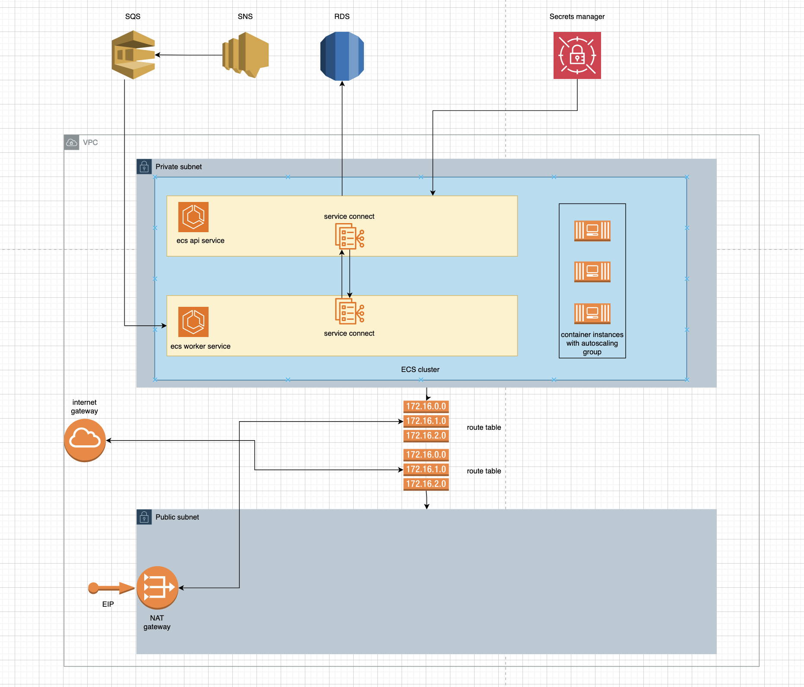

POC for building service mesh in ECS via Cloud Map. This is a work in progress.

Things to note:
- This mostly deploys to a self contained VPC. However, some resources like SNS/SQS/ECR/secrets manager live outside a VPC.

To initialize:
`./scripts/setup.sh`

To deploy:
`./scripts/deploy.sh`

To destroy:
`./scripts/destroy.sh`

To publish app versions:
`./scripts/publish-api-image.sh`
`./scripts/publish-worker-image.sh`

Design summary:
- Encapsulated in new VPC
- 1 public subnet
- 1 route table associate public subnet to internet gateway, as to connect VPC to internet
- 1 private subnet where apps run
- 1 route table associate private subnet to NAT gateway on public subnet
- 2 ECS services running on private subnet
- EC2 intances running as container instances
- Autoscaling for EC2 instances
- Secrets managed in Secret Manager
- 1 ECS service with API to write to RDS
- 1 ECS service consuming from SQS
    - This service consumes messages and publishes them to the ECS API. Thus, messages go from SQS to RDS

